# Student Course Selection Management System

## 需求分析

本系统主要用于满足对学校整体的信息进行管理，分为管理员、教师和学生三种身份，不同的身份据有不同的权限和功能，考虑到实际应用（比如教师学生的学工号固定不可更改），本系统只有登录功能，没有注册功能

1. 管理员

   管理员具有最高的权限，其信息应提前录入到数据库中

   管理员可以对学校的学院、专业(学院下)、班级（专业下）进行添加、修改和删除

   管理员可以录入所有教师和学生的个人信息，并对教师和学生所属的学院、专业和班级进行设置和修改（考虑到有转专业、转班级的需求）；也可以修改教师和学生的学工号密码（当教师或学生忘记密码时可以联系管理员进行修改）

   管理员可以查看学校所有已开设课程的信息，并对其进行管理

2. 学生

   学生可以查看学院为自己年级所开设的所有课程，并进行选择，对于不同的时间段，系统允许学生至多选择一门课程

   学生可以查看自己已经选择的所有课程，并进行退选操作（但不能退选已经得到成绩的课程）

   学生可以查看自己已选课程的可视化课表

   如果教师已经在相应的课程中录入成绩，学生就可以查看自己的成绩

   学生可以对自己的信息进行维护，修改自己的密码，但对于自己的学号、所属学院、所属专业、所属班级和姓名是无权修改的，只能通过管理员

3. 教师

   教师可以查看自己开设的所有课程，并创建新的课程（包括名称、时间、年级、学分，简介等），但对于已创建的课程，教师无权修改，只能联系管理员进行修改和删除

   教师可以查看自己已开设课程的可视化课表

   教师可以查看所有选择自己课程的学生，并对他们的成绩进行录入或者修改

   教师可以对自己的信息进行维护，修改自己的密码，但对于自己的工号、所属学院和姓名是无权修改的，只能通过管理员

## 功能详述及重点界面截图

1. 登陆界面

   用户可以使用三种身份进行登陆，输入学工号、密码、正确的验证码，选择身份即可登入系统

   

2. 管理员界面

   管理员首页界面：登录后进入此界面，界面的帮助手册标明了系统的一些注意事项，可以帮助用户更好地使用系统；点击右上角进入全屏模式；点击右上角账号位置出现退出系统选项

   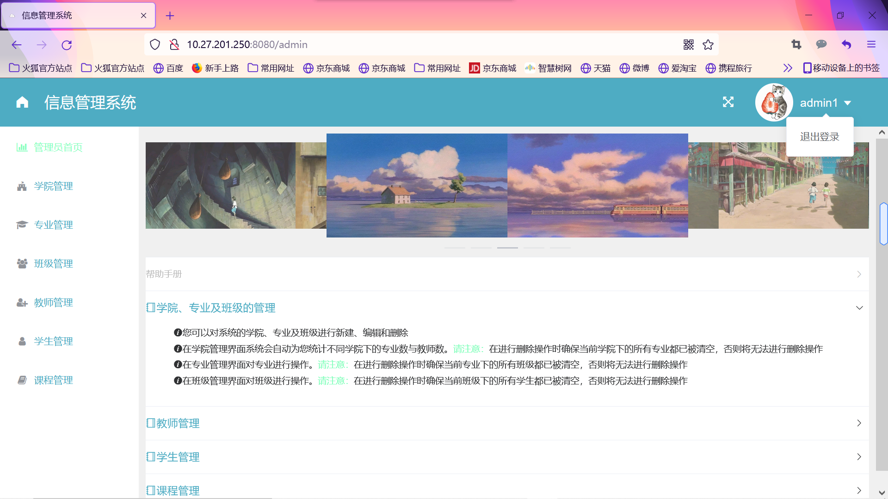

   学院管理界面：点击左侧菜单栏进入学院管理，系统会自动统计不同学院下的专业数与教师数，在这里可以对学校的学院进行新建、编辑和删除；在进行删除操作时需要确保当前学院下的所有专业都已被清空，否则将无法进行删除操作

   

   专业管理界面：点击左侧菜单栏进入专业管理，在这里可以对学校的专业进行新建、编辑和删除；在进行删除操作时需要确保当前专业下的所有班级都已被清空，否则将无法进行删除操作

   

   班级管理界面：点击左侧菜单栏进入班级管理，在这里可以对学校的班级进行新建、编辑和删除；在进行删除操作时需要确保当前班级下的所有学生都已被清空，否则将无法进行删除操作

   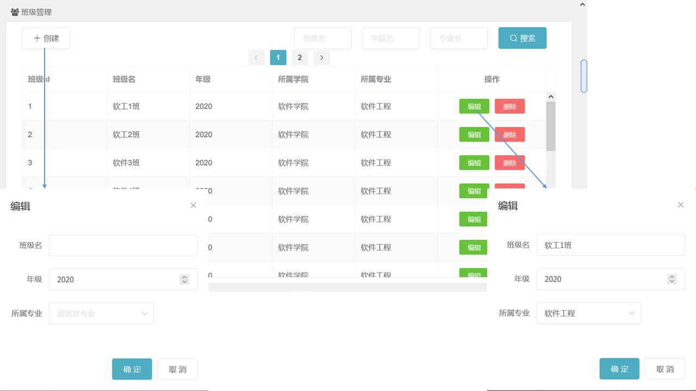

   教师管理界面：点击左侧菜单栏进入教师管理，可以对学校的教师进行新建、编辑和删除；在添加新的教师时，如果用户没有为教师设置密码，系统将自动设置初始密码为“A12345678”；在删除已有教师时，需要确保当前教师所设的所有课程都已被清空，否则将无法进行删除操作

   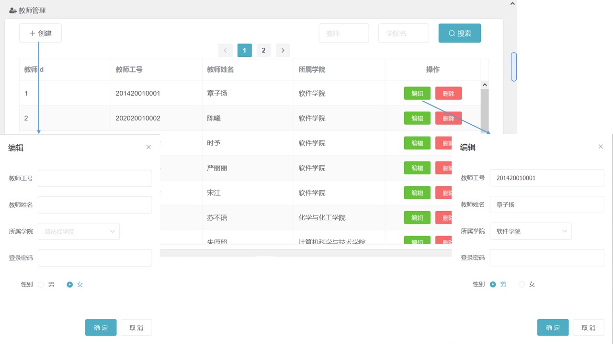

   学生管理界面：点击左侧菜单栏进入学生管理，可以对学校的学生进行新建、编辑和删除；在添加新的学生时，如果用户没有为学生设置密码，系统将自动设置初始密码为“A12345678”；在删除已有学生时，需要确保当前学生所选的所有课程都已被退选，否则将无法进行删除操作

   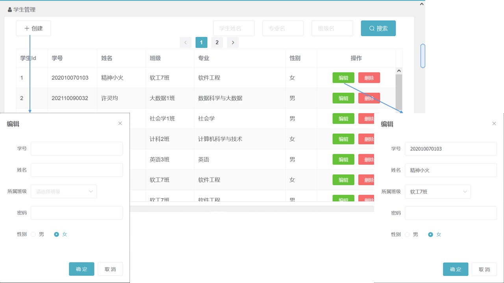

   课程管理界面：点击左侧菜单栏进入课程管理，可以对所有课程进行查看和删除；当一位教师创建新的课程后，该课程的详细信息将会出现在课程管理的列表中；在删除已有课程时，需要确保选择当前课程的所有学生都已退选，否则将无法进行删除操作

   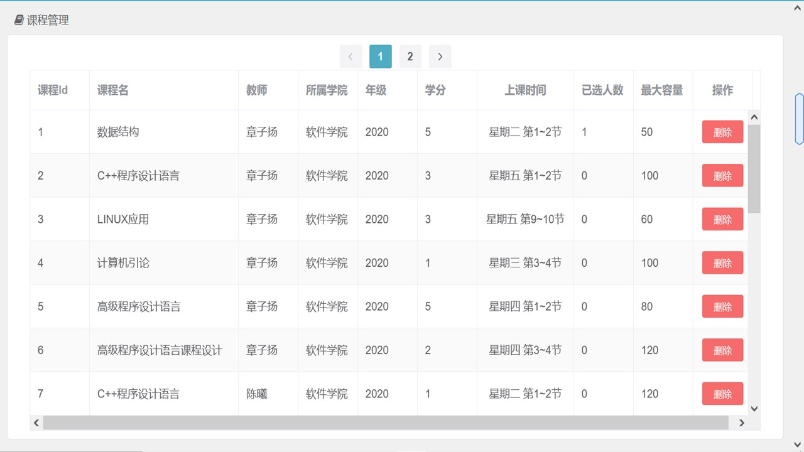

3. 教师界面

   教师首页界面：登录后进入此界面，界面的帮助手册标明了系统的一些注意事项，可以帮助用户更好地使用系统；点击右上角进入全屏模式；点击右上角账号位置出现退出系统选项

   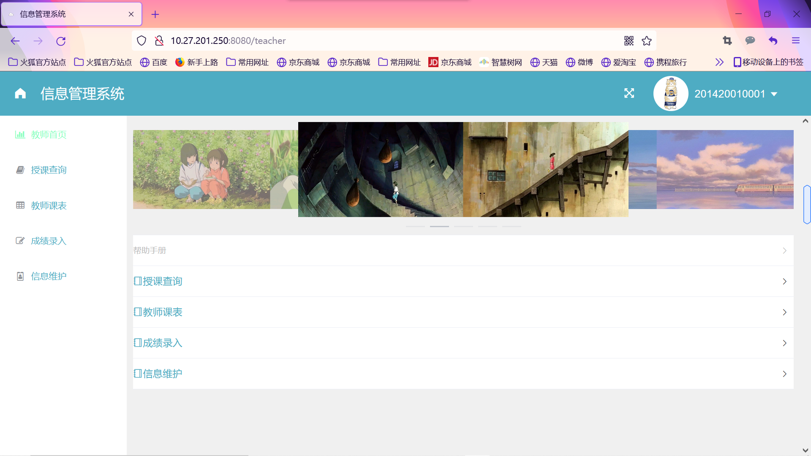

   授课查询界面：点击左侧菜单栏进入授课查询，在此界面用户可以查看自己所开设的所有课程以及选课人数；

   点击创建添加一门新的课程，课程一旦创建当前用户将无权限更改，只有管理员才有权限删除课程，以避免出现学生已选课程的信息发生变化的情况；根据实际需要，系统允许用户创建上课时间相同的不同课程

   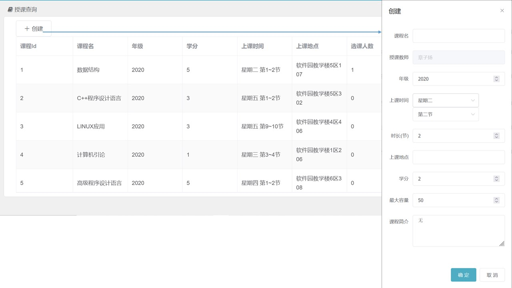

   教师课表界面：点击左侧菜单栏进入教师课表，在此界面用户可以查看自己所授课程的可视化课表；当两门课程的上课时间相同时，课表显示的是用户最后创建的课程，这并不代表用户同时间的其他课程未在系统中，只是没有显示

   

   成绩录入界面：点击左侧菜单栏进入成绩录入，在此界面用户可以对选课学生的成绩进行录入；用户可以通过搜索框查看同一课程的不同学生或同一学生的不同课程，使录入成绩操作更加便捷；平时分与笔试分只是便于学生查看与参考，系统并不会自动生成最终成绩，用户可以根据课程的需要按不同权重录入最终成绩

   

   信息维护界面：点击左侧菜单栏进入信息维护，在此界面用户可以对自己的个人信息进行修改；工号、姓名与学院如需修改需要联系管理员操作；用户也可以通过输入新的密码以修改密码

   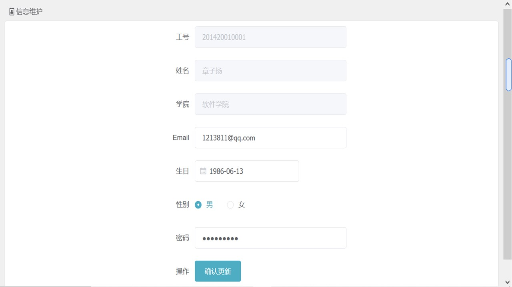

4. 学生界面

   学生首页界面：登录后进入此界面，界面的帮助手册标明了系统的一些注意事项，可以帮助用户更好地使用系统；点击右上角进入全屏模式；点击右上角账号位置出现退出系统选项

   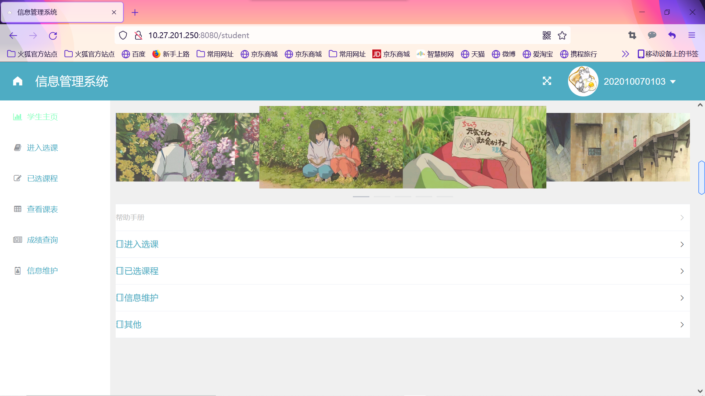

   进入选课界面：点击左侧菜单栏进入选课，在此界面用户可以查看学院为当前用户的年级开设的所有课程，已经被选择的课程不会出现；将鼠标悬停在课程名称处可以查看该课程的课程简介；通过搜索可以根据课程名或者开课教师检索课程，使用户的选课操作更加便捷；点击课程后的选课按钮可以选课，用户在每日的同一时段至多选择一门课程，课程时间冲突将导致选课失败

   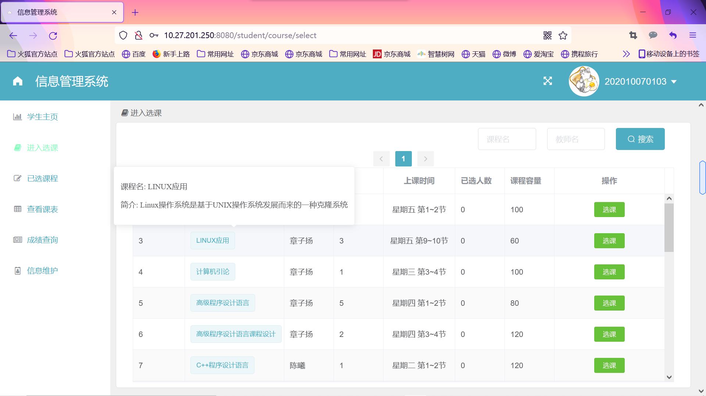

   已选课程界面：点击左侧菜单栏进入已选课程，在此界面用户可以查看自己的所有选课；点击退选进行课程退选操作，授课教师已经录入成绩的课程无法被退选

   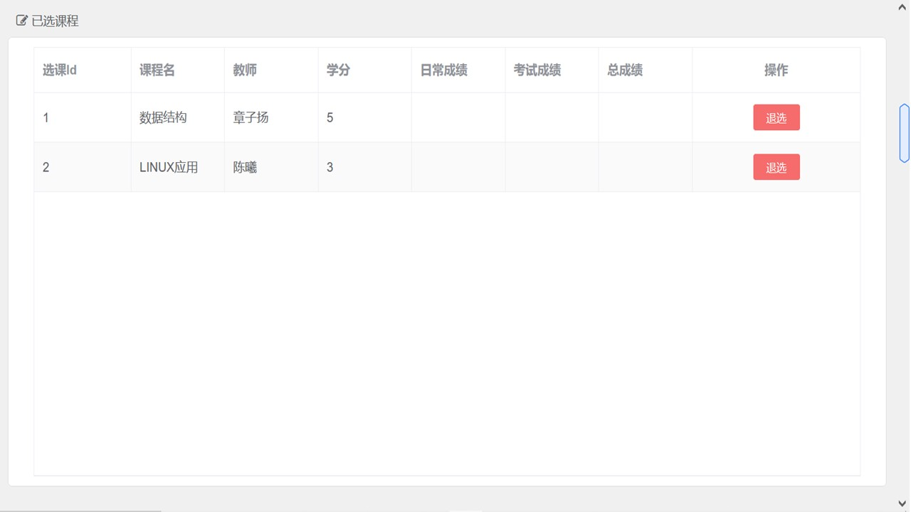

   查看课表界面：点击左侧菜单栏进入查看课表，在此界面用户可以查看自己所选课程的可视化课表

   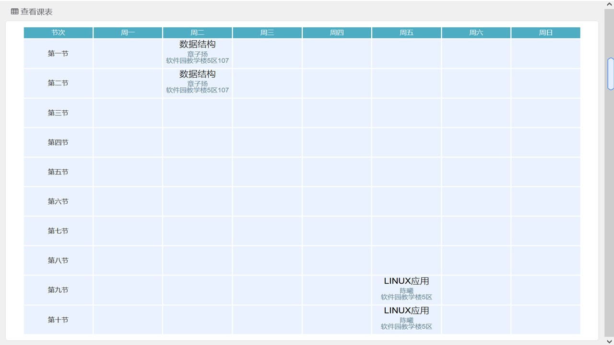

   成绩查询界面：点击左侧菜单栏进入成绩查询，在此界面用户可以查看自己所修课程的成绩，包括平时分、笔试分和最终成绩。如果成绩未显示，则说明教师还未录入成绩

   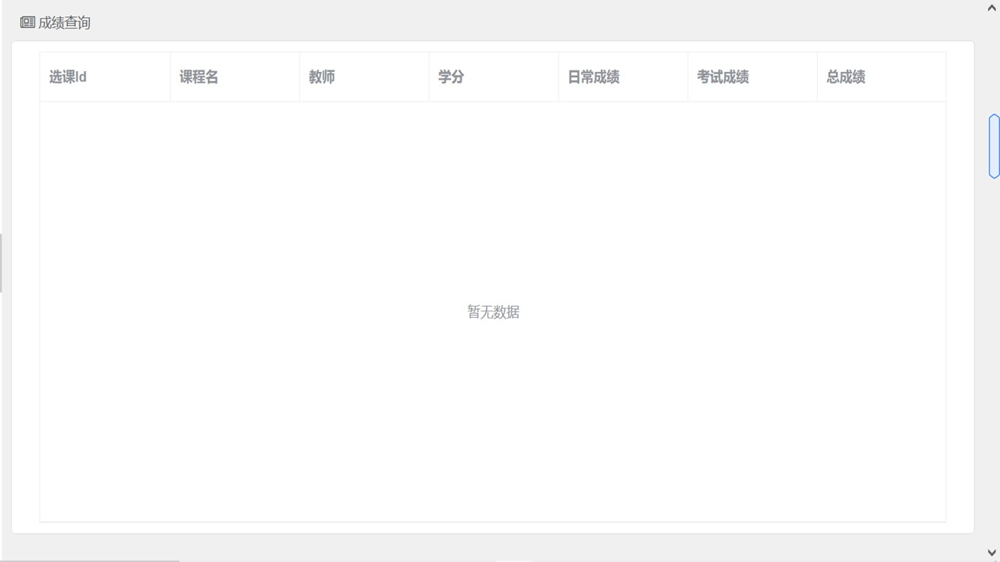

   信息维护界面：点击左侧菜单栏进入信息维护，在此界面用户可以对自己的个人信息进行修改；学号、姓名、学院、专业和班级如需修改需要联系管理员操作；用户也可以通过输入新的密码以修改密码

   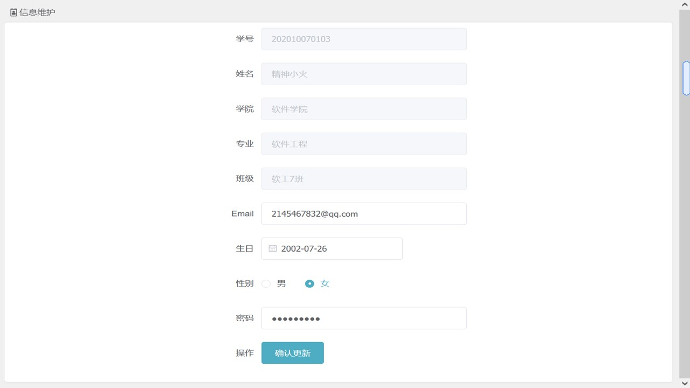

   

## 数据库设计

coursesystem数据库主要包含了八张表，分别是管理员表、教师表、学生表、学院表、专业表、班级表、课程表和学生选课表，数据库关系模型如下

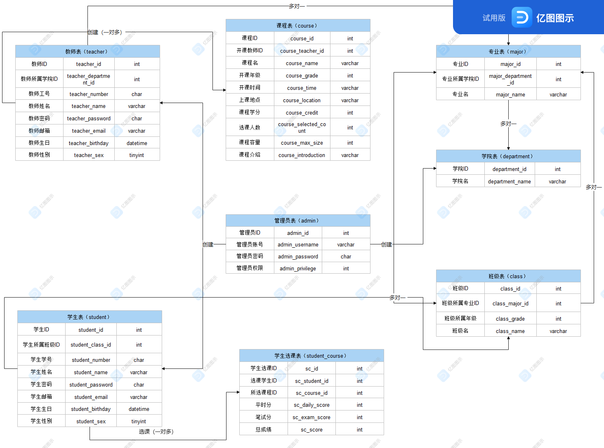

## 系统设计

1. 功能结构设计

   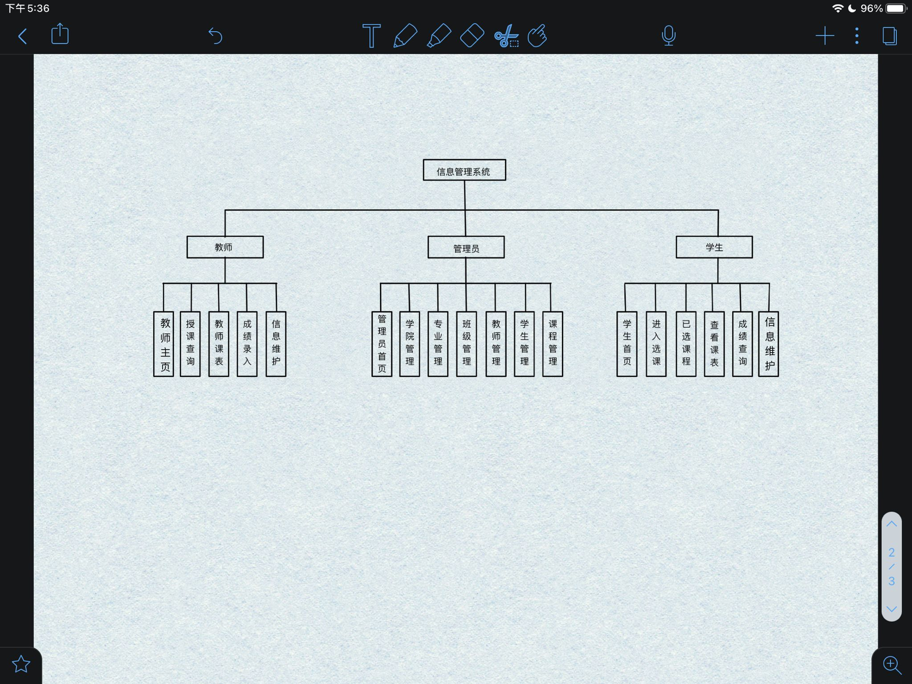

2. 技术架构设计

   